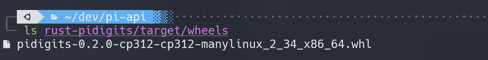

# Rust bindings for Python

We will start by writing the Rust code for our API service. We will use [pyo3](https://pyo3.rs) to create the Rust bindings for Python. PyO3 is a Rust binding for the Python interpreter. It provides a convenient way of extending Python with Rust. PyO3 supports all recent versions of CPython 3 as well as PyPy3.

Create file `chudnovsky.rs` in `rust-pidigits/src` directory:

```rust
use pyo3::{exceptions::PyValueError, PyResult};
use rug::{ops::Pow, Float, Integer};

// chudnovsky algorithm for calculating pi digits to the Nth digit 
// (https://en.wikipedia.org/wiki/Chudnovsky_algorithm). 
//
// Returns a string representation of the pi digits. 
// The number of digits is determined by the digits parameter. 
// The digits parameter must be greater than 0 and less than (2^32-1)/4.

fn binary_split(a: u32, b: u32) -> (Integer, Integer, Integer) {
    if b - a == 1 {
        if a == 0 {
            let pab = Integer::from(1);
            let qab = Integer::from(1);
            let rab = Integer::from(&pab * (13591409 + 545140134 * a));
            return (pab, qab, rab);
        }
        let a_bigint = Integer::from(a);
        let pab: Integer = (Integer::from(6 * &a_bigint) - 5)
            * (Integer::from(2 * &a_bigint) - 1)
            * (Integer::from(6 * &a_bigint) - 1);
        let qab = a_bigint.clone().pow(3) * 10939058860032000u64;
        let rab = &pab * (13591409 + 545140134 * a_bigint);

        if a % 2 == 0 {
            return (pab, qab, rab);
        }
        return (pab, qab, -1 * rab);
    }
    let m = (a + b) / 2;
    let (pam, qam, ram) = binary_split(a, m);
    let (pmb, qmb, rmb) = binary_split(m, b);
    let p1n = Integer::from(&pam * &pmb);
    let q1n = Integer::from(&qam * &qmb);
    let r1n = Integer::from(&ram * &qmb) + Integer::from(&pam * &rmb);
    (p1n, q1n, r1n)
}

pub fn chudnovsky(digits: u32) -> PyResult<String> {
    match digits {
        0 => {
            return Err(PyValueError::new_err(
                "Invalid digits: must be greater than 0",
            ))
        }
        1 => return Ok("3".to_string()),
        _ => {
            if digits.checked_mul(4).is_none() {
                return Err(PyValueError::new_err(
                    "Invalid digits: must be less than (2^32-1)/4",
                ));
            }
        }
    }
    let used_precision = digits * 4;
    let digits_per_term = f32::log10(10939058860032000f32 / 6f32 / 2f32 / 6f32);
    let n = (digits as f32 / digits_per_term).ceil() as u32;
    let i1 = Integer::from(426880);
    let i2 = Float::with_val(used_precision, 10005);

    let (_, q1n, r1n) = binary_split(0, n);
    Ok(((i1 * i2.sqrt() * q1n) / r1n).to_string())
}
```

Next place the following code in `lib.rs` file in `rust-pidigits/src` directory:

```rust
use pyo3::prelude::*;

pub mod chudnovsky;
use chudnovsky::chudnovsky;

#[pyfunction]
fn chudnovsky_pi(py: Python, digits: u32) -> PyResult<String> {
    py.allow_threads(move || chudnovsky(digits))
}

/// A Python module implemented in Rust.
#[pymodule]
fn rust_pidigits(_py: Python, m: &PyModule) -> PyResult<()> {
    m.add_function(wrap_pyfunction!(chudnovsky_pi, m)?)?;
    Ok(())
}
```

The `#[pyfunction]` attribute is used to mark a function as a Python function. The `#[pymodule]` attribute is used to mark a module as a Python module.

```admonish info title="_PyO3 Attributes_"
You can read more about PyO3's attributes, [pyfunction](https://docs.rs/pyo3/latest/pyo3/prelude/attr.pyfunction.html) and [pymodule](https://docs.rs/pyo3/latest/pyo3/prelude/attr.pymodule.html).

The `allow_threads` temporarily releases the GIL, thus allowing other Python threads to run. If you don’t need to touch the Python interpreter for some time and have other Python threads around, this will let you run Rust-only code while letting those other Python threads make progress ([allow_threads in api doc](https://docs.rs/pyo3/latest/pyo3/marker/struct.Python.html#method.allow_threads)).

The `PyResult` type is a wrapper around `Result` that is used to return errors from Python functions. You can read more about PyO3's error handling [here](https://pyo3.rs/v0.20.2/function/error_handling).
```

Now we are ready to build our Rust extension. We will use `maturin` to build our Rust extension. Running `maturin build` will produce a wheel file in the `rust-pidigits/target/wheels` directory. The wheel file will be named `pidigits-0.1.0-cp312-cp312-manylinux_2_34_x86_64.whl` (your version may differ). The wheel file contains the compiled Rust code and the Python bindings. The wheel file can be installed with pip. 

```admonish info title="Wheel Files"
More info about wheel files can be found [here](https://packaging.python.org/en/latest/specifications/binary-distribution-format/#binary-distribution-format).
```

```bash

```bash
poetry run maturin build
```

If you want to build a wheel file for a specific Python version, you can use the `--interpreter` option:

```bash
poetry run maturin build --interpreter python3.12
```

If everything went well, maturin was able to build the wheel file and you should see the produced wheel file in the `rust-pidigits/target/wheels` directory.



Now we are ready to start writing some Python code! 🎉 Nice work! 👍
