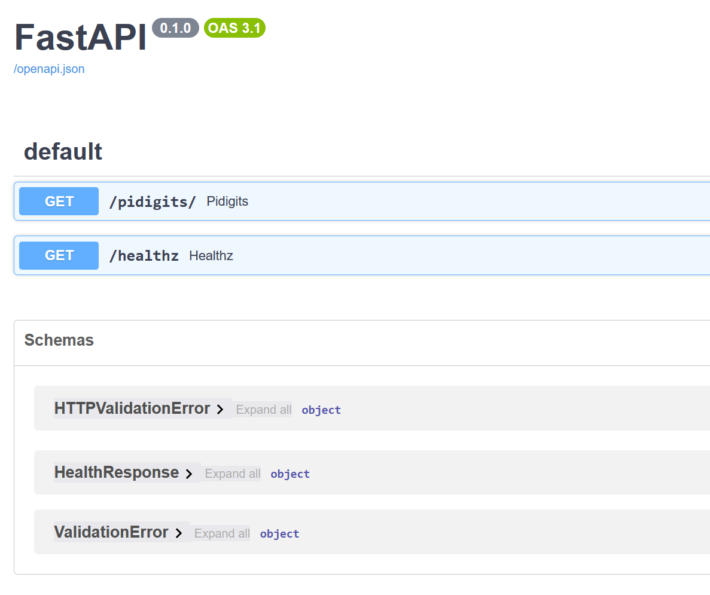

# Starting the API service

We will use uvicorn to run our API service. Uvicorn is a lightning-fast ASGI server implementation, using uvloop and httptools. 

```admonish info title="uvicorn"
You can read more about uvicorn [here](https://www.uvicorn.org/). 
```

Running the following command from the project root will start the API service:

```bash
poetry run uvicorn src.pi_api.main:app --reload --host 0.0.0.0 --port 8000
```

This will start the API service on port 8000. You can now open your browser and go to `http://localhost:8000/healthz` to check the health of the API service. You can also go to `http://localhost:8000/pidigits/?digits=100` to get the first 100 digits of pi. If you like limit the number of digits to 10, you can go to `http://localhost:8000/pidigits/?digits=100&limit=10`.

The FastAPI documentation is available at `http://localhost:8000/docs`. You can also try the API service with the Swagger UI at `http://localhost:8000/redoc`.



You can also use curl to test the API service:

Request:

```bash
curl http://localhost:8000/healthz
```

Output:

```json
{"status": "ok"}
```

Request:

```bash
curl http://localhost:8000/pidigits/?digits=100
```

Output:

```json
"3.1415926535897932384626433832795028841971693993751058209749445923078164062862089986280348253421170679"
```

Request:

```bash
curl http://localhost:8000/pidigits/?digits=100&limit=10
```

Output:

```json
"3.1415926535"
```

If the API service is running, you should get the responses above.

Great! Now we are ready to package our API service in a Docker container! 🎉 Great work! 👍