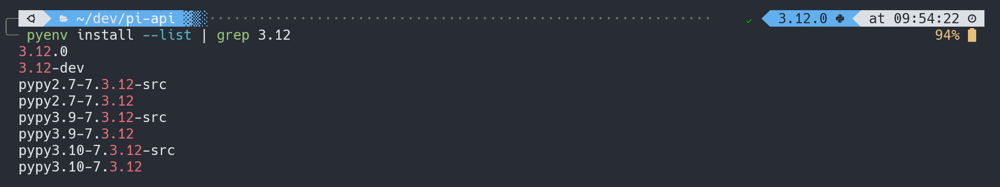

# Install Python using pyenv

We will use pyenv to install latest Python version 3.12
You can check which versions are available with:

```bash
pyenv install --list #this will output all the versions available
```

```bash
pyenv install --list | grep 3.12
```



To actually install Python 3.12, run:

```bash
pyenv install 3.12.0
```

Once the installation is complete, you can set project specific Python version with:

```bash
pyenv local 3.12.0
```

Try to run `python --version` and you should see the following output:

```bash
Python 3.12.0
```

This command creates a .python-version file in your current directory. If you have pyenv active in your environment, this file will automatically activate this version for you.

```admonish warning title="Maximum Performance"
By default, `pyenv` does not enable profile-guided optimization (PGO) and link-time optimization (LTO) when building the interpreter. If you want to get the maximum performance out of your Python code, you should enable the `--enable-optimizations` flag. This will result in a faster interpreter at the cost of significantly longer build times.

See more detail info [here](https://github.com/pyenv/pyenv/blob/master/plugins/python-build/README.md#building-for-maximum-performance)
```
