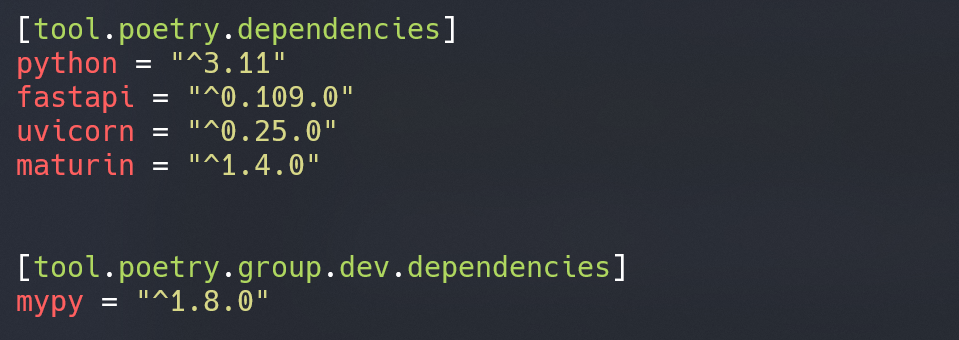

# Add Python dependencies

## Poetry add

We will add the following dependencies to our project:

- [FastAPI](https://fastapi.tiangolo.com/)
- [uvicorn](https://www.uvicorn.org/)
- [maturin](https://www.maturin.rs/)

```bash
poetry add fastapi uvicorn maturin
```

When you run the poetry add command, Poetry automatically updates pyproject.toml (`tool.poetry.dependencies`) and pins the resolved versions in the poetry.lock file.

```admonish info title="Poetry's add command and dependency specification"
You can read more about Poetry's add command [here](https://python-poetry.org/docs/cli/#add). More info about the dependency specification can be found [here](https://python-poetry.org/docs/dependency-specification/).
```

If you like to add a development dependency, you can use the --dev flag:

```bash
poetry add --group dev mypy
```

This will add mypy as a development dependency to your project. Specifically, it will add mypy to the [tool.poetry.dev-dependencies] section in pyproject.toml.

Your pyproject.toml file should now have the following tables (your versions may differ):



## Poetry lock

You can also manually add dependencies to the pyproject.toml file and lock them afterward. After manually adding a dependency to pyproject.toml, you can run the following command to update the lock file:

```bash
poetry lock
```

Note: `poetry lock` will also update the lock file if you have added dependencies with the `poetry add` command. f you don’t want to update any dependencies that are already in the poetry.lock file, then you have to add the --no-update option to the poetry lock command:

```bash
poetry lock --no-update
```

In this case, Poetry only resolves the new dependencies but leaves any existing dependency versions inside the poetry.lock file untouched.

While the version requirement in the pyproject.toml file can be loose, Poetry locks the versions you’re actually using in the `poetry.lock` file. That’s why you should commit this file if you’re using Git. By providing a `poetry.lock` file in a Git repository, you ensure that all developers will use identical versions of required packages. When you come across a repository that contains a poetry.lock file, it’s a good idea to use Poetry for it.

```admonish info title="Poetry's lock command"
You can read more about Poetry's lock command [here](https://python-poetry.org/docs/cli/#lock).  
```

## Poetry install

You can install the dependencies from the lock file with the following command:

```bash
poetry install
```

By running `poetry install`, Poetry reads the poetry.lock file and installs all dependencies that are declared in it.

```admonish info title="Poetry's install command"
You can read more about Poetry's install command [here](https://python-poetry.org/docs/cli/#install).
```

## Poetry update

You can update the dependencies in the lock file with the following command:

```bash
poetry update
```

The `update` command will update all your packages and their dependencies within their version constraints. Afterward, Poetry will update your poetry.lock file. You can control which packages to update by specifying their names. For example, to update only the mypy package, you can run:

```bash
poetry update mypy
```

or to only update the packages in the `tool.poetry.dependencies` section, you can run:

```bash
poetry update --without dev-dependencies
```

```admonish info title="Poetry's update command"
You can read more about Poetry's update command [here](https://python-poetry.org/docs/cli/#update).
```

## About pyproject.toml

The pyproject.toml file is the heart of your project. It’s a configuration file standard that was defined in [PEP 518](https://peps.python.org/pep-0518/). It contains all the metadata about your project, its dependencies, and build instructions. It is meant to replace the old setup.py and requirements.txt files.

```admonish info title="pyproject.toml and Python packaging"
You can read more about pyproject.toml [here](https://python-poetry.org/docs/pyproject/).
Python packaging user guide [here](https://packaging.python.org/en/latest/guides/writing-pyproject-toml/).
```
